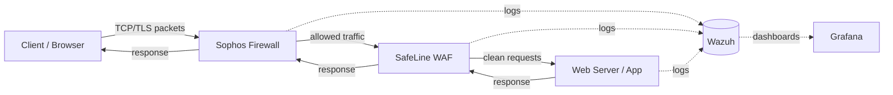
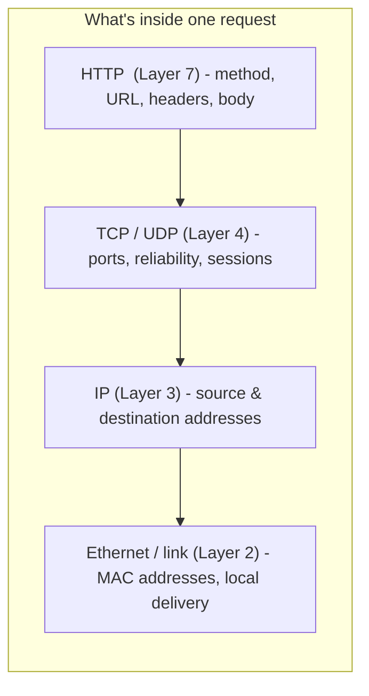
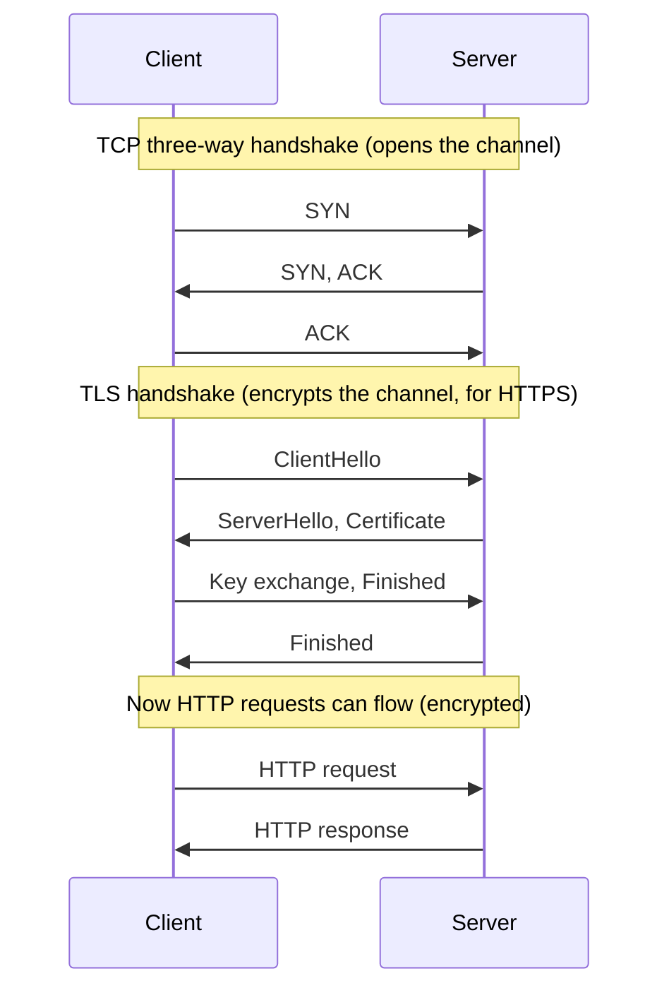
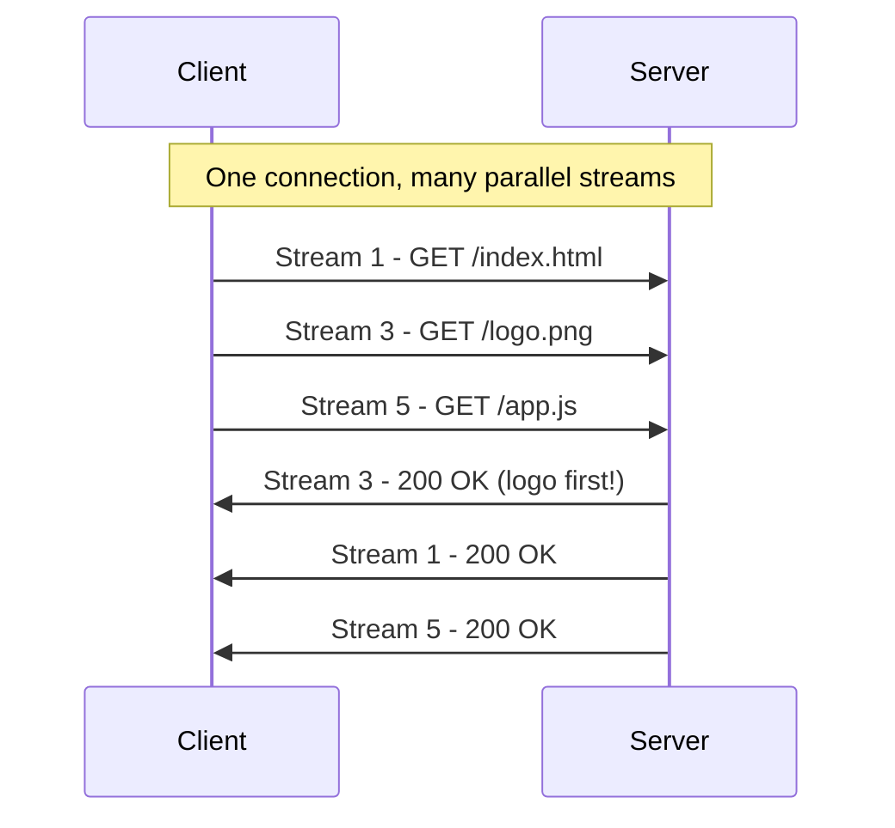
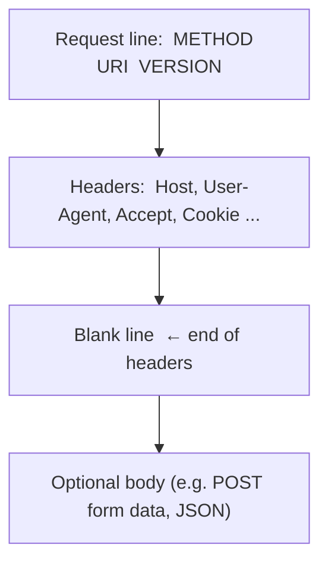
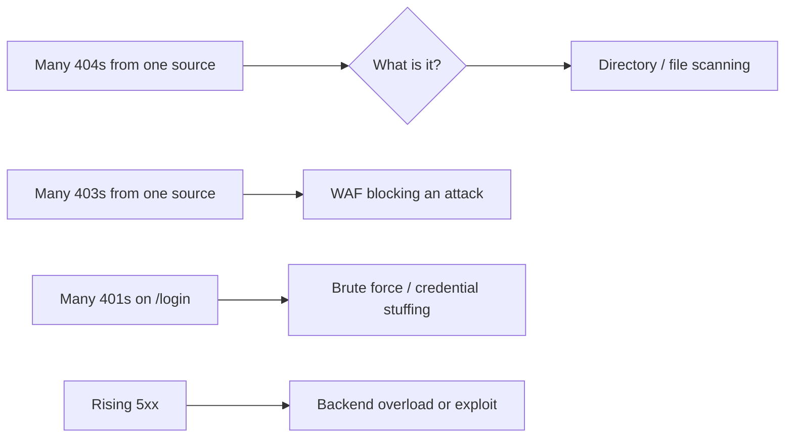
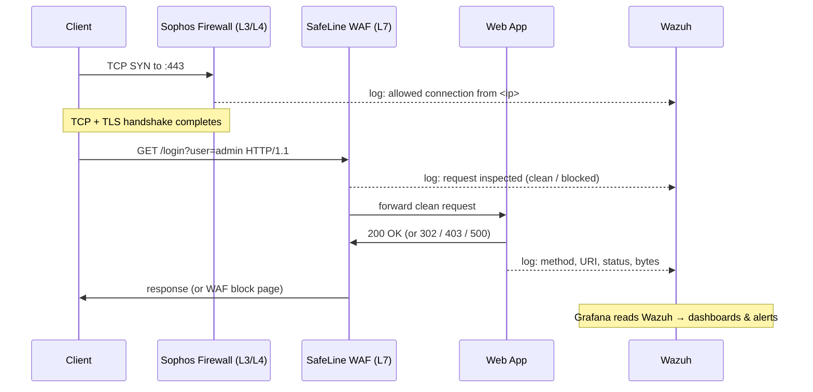

# Incident Response Series - Module 0: How Clients and Servers Talk

> **Goal of this module:** Before we touch Wazuh, Sophos Firewall, SafeLine WAF, or
> Grafana, you need a mental model of what actually travels across the wire when a
> browser loads a page. Once you can picture the *lifecycle of a request*, the logs
> you'll read in Wazuh stop being noise and start telling a story.

This module answers three questions:

1. What happens, step by step, when a client talks to a server?
2. What does an HTTP request and response actually look like?
3. Where do each of those pieces show up in the logs we'll analyze later?

By the end you should be able to point at a line in a Wazuh log and say *"that's the
method, that's the URI, that's the status code the server sent back, and this is the
stage of the connection where it happened."*

---

## 1. The big picture: a packet's journey

When a client at `10.0.40.50` opens `http://10.0.10.30/login` and presses Enter, the
request does **not** go straight to the web application. It passes through several layers, and in
our lab every one of those layers produces logs.



Read it left to right for the request, right to left for the response. The dotted
lines are the important part for us as responders: **every box ships its logs to
Wazuh**, and **Grafana visualizes what Wazuh collects**. An incident is almost always
reconstructed by lining up these logs in time.

Key idea: the *same* request looks different at each layer.
- The **firewall** mostly sees IP addresses, ports, and whether a packet was allowed
  or dropped - it works at a low level (Layer 3/4).
- The **WAF** sees the full HTTP request and can inspect the URL, headers, and body -
  it works at the application level (Layer 7).
- The **web server/app** sees the request that survived all the checks and produces
  the response.

So when you investigate, you're looking at the *same event from three different levels*:
the firewall level (who connected), the WAF level (what they asked for), and the app
level (what the server did about it). Your job is to line those three views up and read
them together.

> **The restaurant analogy (we use this through the whole series).** Picture the server as
> a **restaurant**. A client is a **diner**; a request is **placing an order**; the response
> is **the food coming back**. The journey of a request maps cleanly onto a meal:
>
> - **The firewall** is the **doorman** - he only checks whether you're allowed in at all
>   (your address and which entrance you used), not what you plan to order. That's Layer
>   3/4: IPs and ports.
> - **The WAF** is the **waiter** who reads your full order and can refuse a dodgy one
>   ("we won't serve that"). That's Layer 7: the actual HTTP request - the URL, headers,
>   and body.
> - **The web server/app** is the **kitchen** that actually cooks what got through and
>   sends the plate back.
>
> One order seen three ways: the doorman logs *who came in*, the waiter logs *what was
> ordered*, the kitchen logs *what it cooked*. Reading an incident is just lining up those
> three logbooks by time. We reuse this restaurant picture in every later module - e.g. a
> port scan is someone trying every table in the room, and a 404 flood is someone asking
> for dishes that aren't on the menu.

---

## 2. The network layers (just enough to be dangerous)

HTTP doesn't float in a vacuum. It rides on top of other protocols. A simplified view:



A useful shorthand:

| Layer | Example info | Which tool cares most |
| --- | --- | --- |
| L7 Application (HTTP) | `GET /login`, `User-Agent`, status `403` | SafeLine WAF, web server |
| L4 Transport (TCP/UDP) | source port, dest port 443, SYN/ACK | Sophos Firewall |
| L3 Network (IP) | `10.0.40.50` → `10.0.10.30` | Sophos Firewall |
| L2 Link (Ethernet) | MAC addresses | (rarely in our logs) |

When an analyst says "block it at the firewall," they usually mean L3/L4 (an IP or
port). When they say "the WAF caught an SQL injection," that's L7 - the firewall never
saw the attack *content*, only that bytes flowed to port 443.

---

## 3. The TCP connection - the handshake before any HTTP

Before a single byte of HTTP is sent, the client and server set up a TCP connection
with a **three-way handshake**. For HTTPS, a **TLS handshake** follows to encrypt the
channel.



Why this matters for incident response:
- A flood of **SYN** packets with no completed handshake is a classic **SYN flood /
  DoS** signature - you'll see it at the **firewall**, not the WAF.
- A completed TCP + TLS handshake but then a weird HTTP request is an **application
  attack** - that's the **WAF's** job.
- The firewall logs tell you *who connected and whether the channel opened*. The WAF
  and web server logs tell you *what they said* once it was open.

---

## 4. The HTTP transaction model - one request, one response

HTTP is **transaction-driven**: each request leads to exactly one response. How those
transactions share a connection has evolved over time. Understanding this helps you
read logs where many requests come from the "same" connection or client.

### 4.1 HTTP close mode (old HTTP/1.0 default)

A new TCP connection for every single request, closed right after the response.

```
[CON1] [REQ1] ... [RESP1] [CLO1]   [CON2] [REQ2] ... [RESP2] [CLO2] ...
```

Lots of connections = lots of handshake overhead. The client knew the response was
"done" only when the connection closed - which is why truncated images used to show up
on flaky networks.

### 4.2 Keep-alive / persistent connections (HTTP/1.1 default)

Reuse one TCP connection for several transactions. The server must announce the body
size with `Content-Length` (or use chunked encoding) so the client knows when each
response ends.

```
[CON] [REQ1] ... [RESP1]   [REQ2] ... [RESP2]   [CLO] ...
```

Lower latency, less server CPU, and the client can detect a truncated response.

### 4.3 Pipelining (rarely used in practice)

Keep-alive, but the client fires the next request *without waiting* for the previous
response. Responses must come back in the same order. It was abandoned in practice for
reliability reasons, though servers must still support it.

```
[CON] [REQ1] [REQ2] ... [RESP1] [RESP2] [CLO] ...
```

### 4.4 Multiplexing (HTTP/2 and HTTP/3)

Many request/response pairs - called **streams** - travel in parallel over a single
connection, each with its own ID, progressing independently and completing in any
order.



Notes that help when reading logs:
- Responses can arrive **out of order** (stream 3 came back before stream 1 above).
- **HTTP/2** still suffers *head-of-line (HoL) blocking* - one lost packet stalls all
  streams because they share one TCP connection.
- **HTTP/3** runs over **QUIC** (on top of **UDP**) and fixes HoL blocking: a lost
  packet only affects its own stream.
- In HTTP/2 and HTTP/3, header names are always lowercase, and the request line is
  split into **pseudo-headers** (`:method`, `:path`, `:status`, etc.). Logs often still
  *display* them in the familiar HTTP/1 one-line form for readability.

---

## 5. Terminology you'll see everywhere

These words get used loosely. Pin them down now so logs and dashboards make sense.

| Term | Plain-English meaning |
| --- | --- |
| **Connection** | The low-level channel (usually one TCP socket: a pair of IP+port). The first thing created when a client connects. |
| **Session** | A connection *plus* context - e.g. TLS keys, variables. Also used for TCP sessions in firewalls, or an SSH/telnet session. |
| **Stream** | One end-to-end request+response at the application level. In HTTP/2 and HTTP/3, many streams share one connection; in plain TCP, one stream per connection. |
| **Transaction** | A single request paired with its response. These days, 1:1 with a stream. |
| **Request** | Traffic from client → server. The unit of "activity" counters usually count. |
| **Response** | Traffic from server → client (or from a proxy/WAF when *it* answers, e.g. a block page). |
| **Service** | Internal processing that doesn't need a backend server - a stats page, a cache, a block response. |

> Mental model: **Connection ⟶ (one or more) Streams ⟶ each Stream is one Transaction
> ⟶ a Transaction is one Request + one Response.**

---

## 6. Anatomy of an HTTP request

Here is a textbook HTTP/1.1 request. Every newer version carries the *same information*,
just encoded differently, so this is the canonical thing to memorize.

```http
GET /serv/login.php?lang=en&profile=2 HTTP/1.1
Host: 10.0.10.30
User-Agent: my small browser
Accept: image/jpeg, image/gif
Accept: image/png
```

### 6.1 The request line (line 1)

Always three fields, separated by spaces:

```
GET            /serv/login.php?lang=en&profile=2            HTTP/1.1
└── METHOD ──┘ └──────────────── URI ────────────────────┘ └ VERSION ┘
```

- **Method** - `GET`, `POST`, `PUT`, `DELETE`, etc. Letters only, no colon.
- **URI** - what's being requested. Can be:
  - **relative**: `/serv/login.php?lang=en&profile=2` (what servers usually see)
  - **absolute (URL)**: `http://10.0.10.30:8080/serv/login.php?...` (what proxies see)
  - **`*`**: only with `OPTIONS`, to ask about capabilities
  - **`host:port`**: with `CONNECT`, to open a tunnel (e.g. for HTTPS)
- **Version** - `HTTP/1.1`. (HTTP/2 and HTTP/3 don't send a version on the line; it's
  implied by the protocol.)

Inside the relative URI, split at the `?`:

```
/serv/login.php ? lang=en&profile=2
└──── path ────┘   └── query string ──┘
```

- **Path** - usually points at a resource (a file, a route).
- **Query string** - key/value parameters, very app-specific. **This is where a lot of
  attacks hide** (SQL injection, path traversal, SSRF payloads), which is exactly why
  SafeLine WAF inspects it. The `encoded_slash_test.py` tool in this repo probes how an
  edge treats percent-encoded characters in the path/query - that's an L7 concern.

### 6.2 The request headers (lines 2+)

- Format: `Name: value`. The space after the colon is customary but not required.
- **Header names are case-insensitive.** `Host`, `host`, and `HOST` are the same. In
  HTTP/2/3 they're always sent lowercase.
- A header can repeat or fold multiple values with commas. In the example, the two
  `Accept:` lines plus the comma make **three** accepted types total.
- The headers section ends at the **first empty line**. (People call it a "double line
  feed" - close enough, but technically it's just the first blank line.)



---

## 7. Anatomy of an HTTP response

A response is structured just like a request - both are "HTTP messages."

```http
HTTP/1.1 200 OK
Content-Length: 350
Content-Type: text/html
```

### 7.1 The response line

Three fields:

```
HTTP/1.1       200            OK
└ VERSION ┘    └ STATUS ┘     └ REASON ┘
```

- **Version** - `HTTP/1.1`.
- **Status code** - always 3 digits (see below).
- **Reason** - a human hint like `OK` or `Not Found`. Clients ignore it; it doesn't
  exist in HTTP/2+.

### 7.2 Status codes - the responder's best friend

The first digit tells the whole story:

| Class | Meaning | Common examples | What it tells an analyst |
| --- | --- | --- | --- |
| **1xx** | Informational (skip) | 100, 101 | Signaling only; rarely logged |
| **2xx** | Success, content follows | 200, 206 | The request worked |
| **3xx** | Redirect, no body | 301, 302, 304 | "Go look over there" |
| **4xx** | Client error | 400, 401, 403, 404 | Caller did something wrong/blocked |
| **5xx** | Server error | 500, 502, 503, 504 | The backend failed |

For incident response this is gold:
- A spike of **403**s from one IP often means the **WAF is blocking an attacker**.
- A spike of **404**s often means **scanning/enumeration** (probing for files/paths).
- A spike of **401**s can mean a **brute-force / credential-stuffing** attempt.
- A rise in **5xx** can mean the attack is **succeeding at exhausting the backend**, or
  a misconfiguration.



> **1xx special case:** a `100 Continue` is just a nudge for the client to keep sending
> its body; the real answer comes in the next non-1xx response. A `101` means the
> connection is switching protocols (e.g. to a WebSocket) - the proxy then treats it like
> a tunnel.

### 7.3 Response headers

Same rules as request headers (`Content-Length`, `Content-Type`, `Set-Cookie`, etc.).
`Content-Length` is how the client knows when a keep-alive response is finished; chunked
encoding is the alternative when the size isn't known upfront.

---

## 8. Putting it together: one transaction, end to end

This is the whole model on a single timeline - the thing you'll mentally replay every
time you read a log.



Each arrow is a potential log line. An investigation is just **correlating these lines
by time, source IP, and request** across the firewall, WAF, and app - all gathered in
Wazuh and visualized in Grafana.

---

## 9. Where each piece shows up in Wazuh (the payoff)

| HTTP concept | Typical log field(s) | Source | Why you care |
| --- | --- | --- | --- |
| Source IP / port | `srcip`, `srcport` | Firewall, WAF, web | Who is talking; what to block |
| Method | `GET` / `POST` ... | WAF, web server | Unusual methods can signal probing |
| URI / path | `/login`, `/admin` | WAF, web server | Target of the request; scan patterns |
| Query string | `?id=1' OR '1'='1` | WAF, web server | Where injection payloads appear |
| Status code | `200`, `403`, `404`, `500` | WAF, web server | Success vs block vs error patterns |
| User-Agent | `Nmap Scripting Engine`, `nikto` | WAF, web server | Tool fingerprints of attackers |
| Allowed/dropped | action = allow/deny | Firewall | L3/L4 verdict before HTTP exists |
| Bytes in/out | request/response size | WAF, web server | Oversized payloads, exfiltration |

**Exercise for students:** open Wazuh, filter to the web/WAF logs, and for a single
request identify: the source IP, the method, the URI, and the status code. Then find the
*matching* firewall log for that same connection by time and source IP. You've just
reconstructed one transaction across two levels (the firewall level and the WAF/app
level) - the core skill for everything that follows in this series.

---

## 10. Quick reference / glossary

- **Packet** - a unit of data at the network level (L3/L4). Many packets carry one HTTP
  message.
- **Connection** - one TCP socket (IP:port ↔ IP:port).
- **Handshake** - the SYN/SYN-ACK/ACK exchange (TCP) and the TLS exchange (HTTPS) that
  open a connection *before* HTTP.
- **Stream** - one request+response; HTTP/2 and HTTP/3 run many in parallel per
  connection.
- **Transaction** - one request + its one response.
- **Method** - the verb (`GET`, `POST`, ...).
- **URI / path / query string** - what's requested, and the parameters attached.
- **Status code** - 3 digits; first digit = class (1xx info, 2xx ok, 3xx redirect, 4xx
  client error, 5xx server error).
- **Keep-alive** - reusing one connection for several transactions.
- **Multiplexing** - HTTP/2+ running parallel streams on one connection.
- **HoL blocking** - head-of-line blocking; one stuck/lost item delays others (bad in
  HTTP/2, fixed by HTTP/3 over QUIC).

---

### What's next

With this model in hand, the next modules wire up the lab and start reading real logs:

- **Module 1 (System Architecture)** - the two lab designs (No WAF / With SafeLine WAF)
  behind a Cloudflare tunnel, and how each layer ships logs to Wazuh.
  - **Module 1, Exercise 1** - run Nmap scans (recon through a `--script vuln` attack
    scan) against the DVWA servers and compare what Wazuh shows in both scenarios.
  - **Module 1, Exercise 2** - spot those same scans in the DVWA host's Grafana network
    metrics (TCP resets, TIME_WAIT, passive opens), and correlate with Wazuh.
- **Module 2 -** Reading legitimate GET/HEAD/POST traffic in the logs as a baseline
  (using DVWA's real paths such as `/DVWA/login.php`, over HTTP).
- **Module 3 -** Build Grafana dashboards and Wazuh correlation rules for the status-code
  and attack patterns from section 7.
- **Module 4 onward -** Full incident response scenarios: detect, triage, contain,
  eradicate, recover.
