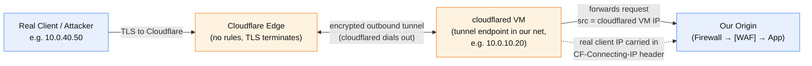
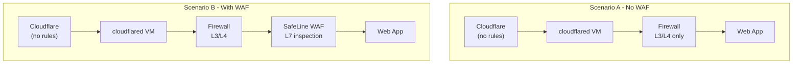

# Incident Response Series - Module 1: System Architecture

This module shows our lab in two states so students can *see* what a WAF changes:

1. **Scenario A - No WAF.** A request reaches the web app after only a firewall check.
2. **Scenario B - With SafeLine WAF.** The same request is inspected at Layer 7 before
   it can reach the app.

In **both** scenarios, the service is published through a **Cloudflare Tunnel**, not a
public origin IP. There are two distinct Cloudflare-related pieces, and it's worth being
clear up front because they're easy to confuse:

- **Cloudflare edge** - Cloudflare's global network *out on the internet*. This is where
  clients connect and where TLS terminates. It is not something we run.
- **cloudflared VM** - a VM *inside our network* running the `cloudflared` daemon. It
  dials **outbound** to the Cloudflare edge and is the last hop before our services.

The encrypted **tunnel** is the link between those two. So yes - every diagram shows two
Cloudflare boxes on purpose: one is Cloudflare's infrastructure, one is our own VM.

**Important for this lab:** Cloudflare has **no security rules configured** - no WAF
rules, no rate limiting, no DDoS challenges. We use it purely to publish the service
online. It forwards every request and blocks nothing. All real security inspection and
detection happens inside **our** stack: **Sophos Firewall** at the edge of our network,
**Wazuh** collecting logs, **Grafana** visualizing them. The thing that moves between
scenarios is where (and whether) *our own* HTTP content inspection happens.

> Read Section 0 first - the tunnel changes what every downstream log contains (notably
> the source IP becomes the **cloudflared VM**), and that affects every investigation in
> this series.

---

## 0. Cloudflare Tunnel in front (pass-through) - why it changes the investigation

Even with zero security rules, the tunnel reshapes the path. Clients never connect to our
origin directly, and there is **no public inbound IP** on our side at all - the
cloudflared VM dials *out* to Cloudflare and traffic rides back down that outbound
tunnel. The cloudflared VM is the last hop before our services, so it is what our
firewall/WAF/app actually see as the client.

1. **The source IP in your logs is the cloudflared VM, not the client (and not a
   Cloudflare edge IP either).**
   Because the cloudflared VM makes the final hop to our services, your firewall, WAF,
   and app all see the **cloudflared VM's internal IP** (e.g. `10.0.10.20`) as the
   connection source - the *same* IP for every single request, whoever sent it. The real
   client IP is carried in the **`CF-Connecting-IP`** header (also in `X-Forwarded-For`).
   You must configure the WAF/app to log that header, otherwise every attacker looks
   identical.
   - **Danger:** if a student blocks "the source IP" at the firewall, they block the
     cloudflared VM - which instantly kills *all* traffic to the service, benign and
     malicious alike. Blocking must happen on the *real* client IP (from
     `CF-Connecting-IP`), applied in the WAF or in Cloudflare, never on the VM IP.

2. **TLS terminates at Cloudflare.**
   The client's encrypted session ends at Cloudflare's edge. Cloudflare then carries the
   request down the tunnel. Our firewall only ever sees traffic from the cloudflared VM,
   not the original client's TLS session.

3. **Cloudflare blocks nothing (by design, in this lab).**
   With no WAF/rate-limit/DDoS rules, **every request reaches our stack**. Nothing is
   stopped at the edge. This is intentional: we want all traffic - benign and malicious -
   to flow through to our firewall and WAF so students can detect it in Wazuh. (In a real
   deployment you would normally enable Cloudflare's protections too; here we deliberately
   don't, to study our own tools.)

4. **No public origin to lock down - the tunnel removes inbound exposure.**
   Unlike a classic "DNS points at our origin IP" setup, a tunnel means our network has
   **no public inbound port** for an attacker to find or hit directly. cloudflared only
   makes *outbound* connections. So there is no origin IP to discover and no
   "allow only Cloudflare IP ranges" firewall rule to maintain - the attack surface is
   just whatever the tunnel exposes. This is a genuine security benefit worth pointing
   out to students.

5. **Caching can hide requests.**
   Cloudflare may serve cached static responses from its edge without pulling from the
   origin, so the app's logs won't necessarily contain *every* request a user made - only
   cache misses and dynamic/uncacheable requests travel the tunnel to the origin. For a
   mostly dynamic service this effect is small, but keep it in mind.

> **One-line takeaway:** every request arrives at our stack from the **cloudflared VM's
> IP**, so that field is useless for identifying attackers - use `CF-Connecting-IP` for
> the real client, and never block the cloudflared VM IP at the firewall or you take the
> whole service offline.

---

## Scenario A - No WAF (baseline)

Cloudflare publishes the site through the tunnel but enforces nothing, so every request
is carried down to the **cloudflared VM** and forwarded into our network. The Sophos
firewall makes its L3/L4 decision (IP, port, allow/deny) and the request goes straight to
the web application. Nobody *anywhere* inspects the HTTP content - method, URL, headers,
or body. An attack payload passes all the way through untouched as long as the packet is
allowed.

```mermaid
flowchart LR
    C["Real Client / Attacker"]
    CF["Cloudflare Edge<br/>(no rules, TLS terminates)"]
    CFD["cloudflared VM<br/>(tunnel endpoint,<br/>e.g. 10.0.10.20)"]
    FW["Sophos Firewall<br/>(L3/L4: IP, port, allow/deny)"]
    APP["Web Server / App<br/>(L7: sees raw HTTP)"]

    C -->|"HTTPS to Cloudflare"| CF
    CF <-->|"encrypted tunnel"| CFD
    CFD -->|"forwarded request<br/>(src = cloudflared VM IP)"| FW
    FW -->|"allowed packets"| APP
    APP -->|"response"| FW
    FW -->|"response"| CFD
    CF -->|"response"| C

    FW -. "connection logs" .-> WZ[("Wazuh")]
    APP -. "access logs" .-> WZ
    WZ -. "dashboards / alerts" .-> GRAF["Grafana"]

    classDef cf fill:#fef3e0,stroke:#f38020,color:#111;
    classDef edge fill:#e8f0fe,stroke:#4285f4,color:#111;
    classDef app fill:#e6f4ea,stroke:#34a853,color:#111;
    classDef mon fill:#fef7e0,stroke:#f9ab00,color:#111;
    class CF,CFD cf;
    class C,FW edge;
    class APP app;
    class WZ,GRAF mon;
```

**What gets inspected:** nothing at Cloudflare (no rules), then only L3/L4 at our
firewall. The app receives whatever arrives, malicious or not.

**Where attacks land:** directly on the application. If the payload exploits the app
(SQLi, path traversal, etc.), the app is what gets hit.

**What the logs show:**
- *Firewall:* a connection from the **cloudflared VM IP** (same IP for every request),
  destination port, allow/deny - no idea what the HTTP said.
- *Web app:* method, URI, status, user-agent, and the real client IP **only if** it logs
  `CF-Connecting-IP`. This is the first (and only) place the attack content is visible -
  and only *after* it reached the app.

**IR consequence:** detection is reactive. You learn about the attack from the app's own
logs (a 500, a suspicious query) or from the damage. Nothing in front stopped it.

---

## Scenario B - With SafeLine WAF

Same tunnel front door, but now SafeLine sits between the firewall and the app. Cloudflare
still blocks nothing; traffic still arrives via the cloudflared VM; the firewall still
makes its L3/L4 call; then the WAF performs **Layer 7 inspection** of the full HTTP
request. Clean requests are forwarded to the app; malicious ones are blocked (SafeLine
returns a block page, usually a `403`).

```mermaid
flowchart LR
    C["Real Client / Attacker"]
    CF["Cloudflare Edge<br/>(no rules, TLS terminates)"]
    CFD["cloudflared VM<br/>(tunnel endpoint,<br/>e.g. 10.0.10.20)"]
    FW["Sophos Firewall<br/>(L3/L4: IP, port, allow/deny)"]
    WAF["SafeLine WAF<br/>(L7: inspects URL, headers, body)"]
    APP["Web Server / App"]

    C -->|"HTTPS to Cloudflare"| CF
    CF <-->|"encrypted tunnel"| CFD
    CFD -->|"forwarded request<br/>(src = cloudflared VM IP)"| FW
    FW -->|"allowed packets"| WAF
    WAF -->|"clean requests only"| APP
    WAF -. "blocks malicious<br/>(returns 403)" .-> CFD
    APP -->|"response"| WAF
    WAF -->|"response"| FW
    FW -->|"response"| CFD
    CF -->|"response"| C

    FW -. "connection logs" .-> WZ[("Wazuh")]
    WAF -. "L7 inspection logs<br/>(allowed / blocked)" .-> WZ
    APP -. "access logs" .-> WZ
    WZ -. "dashboards / alerts" .-> GRAF["Grafana"]

    classDef cf fill:#fef3e0,stroke:#f38020,color:#111;
    classDef edge fill:#e8f0fe,stroke:#4285f4,color:#111;
    classDef waf fill:#fce8e6,stroke:#ea4335,color:#111;
    classDef app fill:#e6f4ea,stroke:#34a853,color:#111;
    classDef mon fill:#fef7e0,stroke:#f9ab00,color:#111;
    class CF,CFD cf;
    class C,FW edge;
    class WAF waf;
    class APP app;
    class WZ,GRAF mon;
```

**What gets inspected:** nothing at Cloudflare, L3/L4 at the firewall, **plus** full L7 at
SafeLine (request line, headers, query string, body).

**Where attacks land:** on the WAF first. A blocked attack never reaches the app, so the
app stays clean.

**What the logs show:**
- *Firewall:* a connection from the cloudflared VM IP - allowed.
- *WAF:* the richest signal in the whole stack - request content, matched rule, verdict
  (allowed vs blocked, usually `403`), and the real client IP if `CF-Connecting-IP` is
  honored. **Primary detection source.**
- *Web app:* only the requests the WAF let through - cleaner, more trustworthy logs.

**IR consequence:** detection becomes proactive. Many attacks show up as WAF **block**
events (`403` spikes) before they can harm the app, and you can correlate a WAF block
with the firewall connection that carried it.

---

## Side-by-side: what actually changed

The tunnel path (Cloudflare edge + cloudflared VM) is constant in both. The only
structural change is adding SafeLine.

| Aspect | Scenario A (No WAF) | Scenario B (With WAF) |
| --- | --- | --- |
| Edge (Cloudflare) protection | None (pass-through) | None (pass-through) |
| HTTP content inspected? | No (nowhere) | Yes, at the WAF |
| First place an attack is seen | The app (after it arrives) | The WAF (before it arrives) |
| Primary detection source (in Wazuh) | App logs | WAF logs (block events) |
| App log quality | Noisy - includes attacks | Cleaner - only passed traffic |
| Typical "we blocked it" signal | None | `403` block events in the WAF |
| Detection style | Reactive | Proactive |
| Source IP seen in logs | cloudflared VM IP (real IP via `CF-Connecting-IP`) | Same |

> **Teaching point:** since Cloudflare enforces nothing here, there are really two
> questions at two layers inside our stack: the firewall (*can this IP reach the
> service?*) and the WAF (*is this request's content malicious?*). Scenario A answers only
> the first; Scenario B answers both - and the WAF's answer is where most of our
> web-attack detection will come from. And in both, the source IP on the wire is always
> the cloudflared VM, so the real attacker lives in `CF-Connecting-IP`.

---

### What's next

- **Module 2 -** Generate benign and malicious traffic (using the probe scripts in this
  repo) and watch the same request appear across the firewall, WAF, and app logs -
  comparing Scenario A vs Scenario B, and recovering the real client IP via
  `CF-Connecting-IP`.
- **Module 3 -** Build Grafana dashboards for status-code patterns (`403` blocks, `404`
  scans, `401` brute force) sourced from Wazuh.
