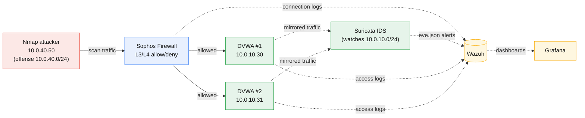
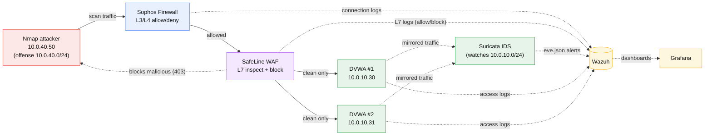
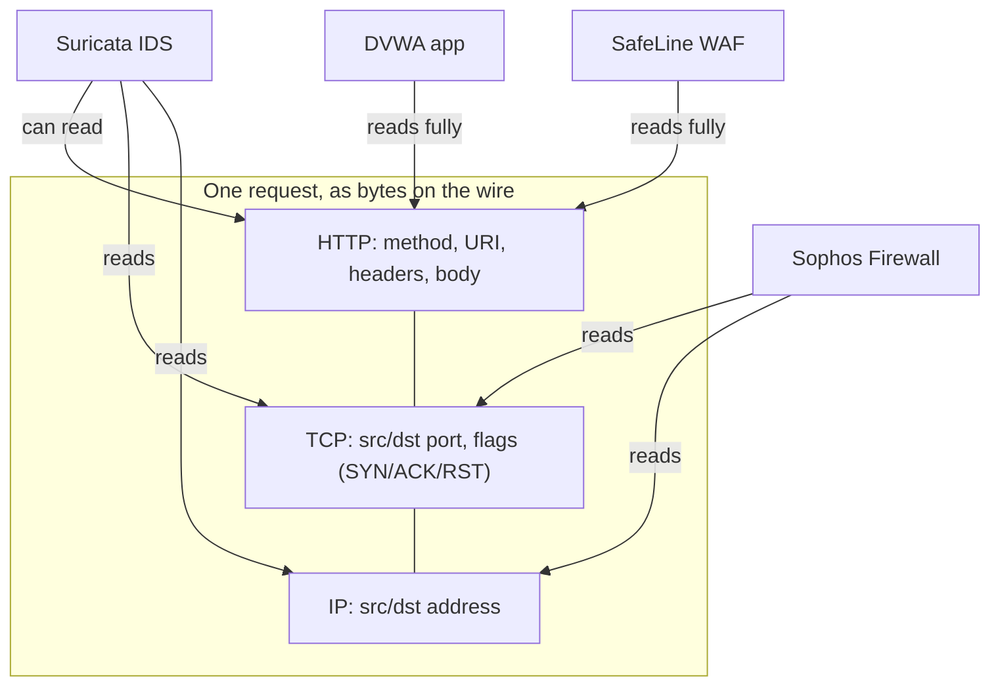
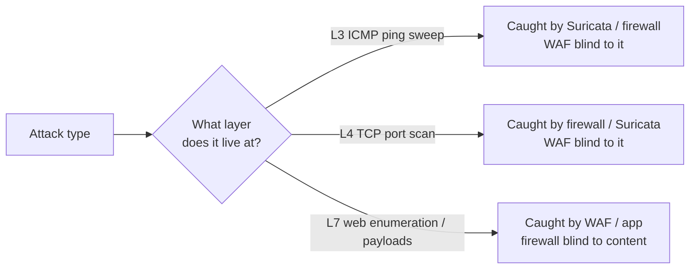
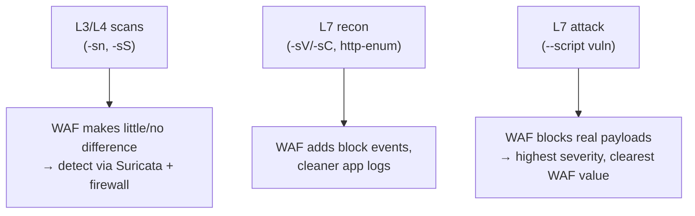

# Incident Response Series - Module 1 Exercise: Nmap Scans in Wazuh (No WAF vs With WAF)

This exercise goes with **Module 1 (System Architecture)**. There we drew two scenarios:

- **Scenario A - No WAF:** cloudflared VM → Sophos Firewall → DVWA.
- **Scenario B - With WAF:** cloudflared VM → Sophos Firewall → **SafeLine WAF** → DVWA.

Now we run the *same* Nmap scans against the DVWA servers in **both** scenarios and look
at **what Wazuh shows** each time. The whole point: see how adding the WAF changes what
lands in Wazuh for the identical attack.

> **Same restaurant analogy from Module 0.** The server is a **restaurant**: the firewall
> is the **doorman** (checks who's allowed in), the WAF is the **waiter** (reads the full
> order and can refuse a bad one), the kitchen is the **app**. Each Nmap scan is a
> different thing a troublemaker does in that restaurant, and each tool sees a different
> part of it:
>
> | Scan | What it is, in the restaurant | Who notices (and logs it) |
> | --- | --- | --- |
> | `-sn` ping sweep | Phoning ahead: "are you open tonight?" | Doorman / Suricata (no order yet) |
> | `-sS` SYN port scan | Walking up to every table to see which are set | Doorman / Suricata (ports, not orders) |
> | `-sV -sC` | Peeking at each table to read what's being served | Waiter + kitchen start to see it (L7) |
> | `http-enum` | Reading down the menu asking for things room by room | Waiter (WAF) and kitchen logs |
> | `-A -T4` | Doing all of the above at once, loudly | Everyone at once |
> | `--script vuln` | Trying to dine-and-dash / tamper with the food | Waiter blocks it; kitchen sees the attempt |
>
> Keep this in mind: the doorman (firewall) never sees the *order*, only who walked in.
> Once a scan becomes an actual *order* (Layer 7), the waiter (WAF) is what catches and
> refuses it. That is exactly why the two scenarios below differ only once a scan reaches
> the waiter.

### Lab setup

| Range / host | Role |
| --- | --- |
| `10.0.40.0/24` | **Offense** network |
| `10.0.40.50` | Attacker host (runs Nmap) |
| `10.0.10.0/24` | **Defense** network |
| `10.0.10.30` | DVWA server #1 |
| `10.0.10.31` | DVWA server #2 |

**What feeds Wazuh (same in both scenarios unless noted):**
- **Sophos Firewall** - connection logs (L3/L4: src/dst/port, allow/deny).
- **Suricata IDS** - watches the `10.0.10.0/24` segment, raises packet-level alerts.
- **DVWA web server** - access logs (method, URI, status, user-agent).
- **SafeLine WAF** - *Scenario B only* - L7 inspection logs (method, URI, status, verdict).

> Wazuh lines below are **representative examples** showing shape and the fields that
> matter. Exact rule IDs, descriptions, and field names depend on your decoders and
> versions - treat them as "what to look for."

> **Lab safety:** only scan `10.0.10.30` and `10.0.10.31`. They are intentionally
> vulnerable training targets you own. Never scan anything else.

---

## System design - the two scenarios

Same attacker, same targets, same Wazuh. The only structural change between the scenarios
is whether SafeLine sits in the request path. These are the designs you'll be scanning.

### Scenario A - No WAF

The scan traffic goes Nmap → firewall → DVWA. Suricata watches the segment and the
firewall and app ship logs to Wazuh. There is **no L7 inspection** of the HTTP content.



### Scenario B - With SafeLine WAF

Now SafeLine sits between the firewall and the DVWA servers and inspects every HTTP
request. It forwards clean traffic and blocks malicious requests, and it ships its own L7
logs (allowed/blocked verdicts) to Wazuh - a source that simply doesn't exist in Scenario
A.



---

## What each layer sees (and why)

A scan is one stream of packets, but each layer only understands part of it. This is why
some scans show up at the firewall and others only at the WAF/app - each device parses up
to a different point in the packet and stops.



| Layer / device | Sees | Does NOT see | Why |
| --- | --- | --- | --- |
| **Sophos Firewall** | IPs, ports, TCP flags, allow/deny | URL, method, body | It routes/filters by address + port; it doesn't parse HTTP |
| **Suricata IDS** | IPs, ports, flags, packet patterns, and HTTP if unencrypted | Encrypted payload contents | It's a packet inspector; it reconstructs streams and matches signatures |
| **SafeLine WAF** | Full HTTP: method, URI, headers, body, verdict | Lower-layer scan patterns (not its job) | It terminates/parses HTTP to apply L7 rules |
| **DVWA app** | Full HTTP it received | Anything blocked before it; raw packets | It only gets requests that reached it |

**The rule of thumb:** the lower the layer an attack lives at, the earlier (and more
network-centric) the device that catches it.



This single idea drives the whole exercise: **ping and port scans are network-layer, so
the WAF can't help; web enumeration and payloads are application-layer, so the WAF is
exactly where you catch and block them.**

---

## How to run it

For each scan:
1. Note the start time, run the Nmap command from `10.0.40.50`.
2. Open **Wazuh**, filter `data.src_ip: 10.0.40.50` for your time window.
3. First with the lab in **Scenario A (no WAF)**, then switch the lab to **Scenario B
   (WAF in path)** and run the *same* scan again.
4. Compare the two Wazuh views and answer the check questions.

The key column to watch in Wazuh is the **log source** (`location` / `decoder` /
`groups`) and whether a **SafeLine block** appears.

---

## Scan 1 - Ping sweep (host discovery)

*Restaurant: phoning ahead to ask "are you open tonight?" - no order placed yet.*

```bash
nmap -sn 10.0.10.30 10.0.10.31
```

This is pure L3 (ICMP/ARP). It never reaches HTTP, so **the WAF plays no part** - the two
scenarios look the same in Wazuh.

**Wazuh - Scenario A (No WAF):**
```
rule.description="Suricata: ET SCAN ICMP ping sweep"
data.src_ip=10.0.40.50 data.dest_ip=10.0.10.30,10.0.10.31 rule.level=5
location="suricata" groups=[suricata,recon]
```

**Wazuh - Scenario B (With WAF):**
```
# Identical - WAF never sees L3 ping traffic
rule.description="Suricata: ET SCAN ICMP ping sweep"
data.src_ip=10.0.40.50 data.dest_ip=10.0.10.30,10.0.10.31 rule.level=5
location="suricata" groups=[suricata,recon]
```

**Takeaway:** a WAF is a Layer 7 device. For an L3 ping sweep there's **no difference** in
Wazuh - detection comes entirely from Suricata/firewall. Don't expect the WAF to help with
network-layer recon.

**Check questions:**
- Are the Wazuh alerts for this scan identical in A and B? Why would you expect that?
- Which log source produced the alert - Suricata, firewall, WAF, or app?

---

## Scan 2 - TCP SYN port scan

*Restaurant: walking up to every table to see which ones are set and open - still no
actual order, so the doorman notices but the waiter has nothing to read.*

```bash
nmap -sS 10.0.10.30 10.0.10.31
```

Still L3/L4 (TCP ports), so again the WAF mostly doesn't change the picture - port scans
are a firewall/Suricata story.

**Wazuh - Scenario A (No WAF):**
```
# Firewall: burst of connection attempts, one src, many dst ports
rule.description="Sophos: multiple denied connections (possible scan)"
data.src_ip=10.0.40.50 data.dest_port=21,23,135,3306,... data.action=deny rule.level=6
location="sophos-fw" groups=[firewall,scan]

# Suricata: SYN scan signature
rule.description="Suricata: ET SCAN Nmap SYN scan"
data.src_ip=10.0.40.50 rule.level=6 location="suricata" groups=[suricata,recon,scan]
```

**Wazuh - Scenario B (With WAF):**
```
# Same firewall + Suricata alerts as A.
# PLUS: on the open web port (80 - DVWA is HTTP only), the SYN probes reach the
# WAF's listener. SafeLine logs connection-level activity but no HTTP request was
# completed by the scan, so you may see WAF 'connection' entries without a method/URI:
rule.description="SafeLine: connection without complete HTTP request"
data.src_ip=10.0.40.50 data.dest_port=80 data.method="-" data.uri="-" rule.level=4
location="safeline" groups=[waf]
```

**Takeaway:** the firewall/Suricata signal is the same in both. In Scenario B you *may*
get extra low-value WAF "half-open / no request" entries on the web ports, but the port
scan itself is still detected at L3/L4, not by the WAF.

**Check questions:**
- Compare the distinct `dest_port` count for `src_ip=10.0.40.50` in A vs B - is it the
  same? (It should be; the scan didn't change.)
- In B, did SafeLine log anything useful, or just noise? Why can't it classify a SYN scan
  as a web attack?

---

## Scan 3 - Service/version + default scripts

*Restaurant: peeking at each open table to read what's being served and who the chef is -
now a real order is placed, so the waiter (WAF) finally has something to inspect.*

```bash
nmap -sV -sC 10.0.10.30
```

Now Nmap makes **real HTTP requests** on port 80 - so the WAF finally has something to
inspect, and the scenarios start to diverge.

**Wazuh - Scenario A (No WAF):**
```
# Suricata + DVWA app logs. The scan's requests hit the app directly.
rule.description="Suricata: Nmap NSE user-agent detected"
data.src_ip=10.0.40.50 data.http.user_agent="Nmap Scripting Engine" rule.level=6
location="suricata"

rule.description="Web access: GET / 302 -> /DVWA/login.php"
data.src_ip=10.0.40.50 data.url="/" data.status=302 data.user_agent="Nmap Scripting Engine"
location="dvwa-apache" groups=[web]
# DVWA root redirects unauthenticated users to the login page:
rule.description="Web access: GET /DVWA/login.php 200"
data.src_ip=10.0.40.50 data.url="/DVWA/login.php" data.status=200 data.user_agent="Nmap Scripting Engine"
location="dvwa-apache" groups=[web]
```

**Wazuh - Scenario B (With WAF):**
```
# Same Suricata NSE alert, PLUS a SafeLine L7 record for every probe request.
rule.description="Suricata: Nmap NSE user-agent detected"
data.src_ip=10.0.40.50 data.http.user_agent="Nmap Scripting Engine" rule.level=6
location="suricata"

rule.description="SafeLine: request inspected"
data.src_ip=10.0.40.50 data.method=GET data.uri="/DVWA/login.php" data.status=200
data.user_agent="Nmap Scripting Engine" data.action=pass rule.level=5
location="safeline" groups=[waf]
# If SafeLine's bot/UA rules are on, the NSE user-agent may be blocked instead:
rule.description="SafeLine: blocked suspicious user-agent"
data.src_ip=10.0.40.50 data.action=block data.status=403 data.rule="bad-user-agent" rule.level=7
location="safeline" groups=[waf,block]
```

**Takeaway:** this is where the WAF starts earning its place. In Scenario B you get a
clean, structured L7 record (method/URI/status/verdict) in Wazuh for each probe, and -
depending on SafeLine's rules - the `Nmap Scripting Engine` user-agent may be **blocked**
outright (a `403`). In Scenario A you only see the app's own access log after the fact.

**Check questions:**
- In B, is the NSE user-agent passed or blocked by SafeLine? What rule decided that?
- Which scenario gives you a *verdict* (allowed/blocked) in Wazuh, not just a record?

---

## Scan 4 - HTTP enumeration (the clearest WAF difference)

*Restaurant: reading down the whole menu asking "do you serve this? this? this?" - most
answers are "not on the menu", and the waiter can refuse the dodgy requests.*

```bash
nmap -p80 --script http-enum 10.0.10.30 10.0.10.31
```

A flood of `GET`/`HEAD` for common paths - a pure L7 attack, so this is where the two
scenarios differ the most.

**Wazuh - Scenario A (No WAF):**
```
# DVWA access logs: the enum requests reach the app; many 404s.
rule.description="Web access: GET /admin/ 404"
data.src_ip=10.0.40.50 data.url="/admin/" data.status=404 data.user_agent="Nmap Scripting Engine"
location="dvwa-apache" groups=[web]
rule.description="Web access: GET /phpmyadmin/ 404"
data.src_ip=10.0.40.50 data.url="/phpmyadmin/" data.status=404 ...
# Suricata may also fire a path-probe alert.
# Nothing BLOCKED - every probe reached the application.
```

**Wazuh - Scenario B (With WAF):**
```
# SafeLine inspects each path. Clean paths pass; probe paths get BLOCKED (403).
rule.description="SafeLine: request inspected"
data.src_ip=10.0.40.50 data.uri="/admin/" data.status=404 data.action=pass rule.level=5
rule.description="SafeLine: blocked path probe"
data.src_ip=10.0.40.50 data.uri="/config/" data.status=403 data.action=block data.rule="path-probe" rule.level=7
location="safeline" groups=[waf,block]
# The DVWA app logs are CLEANER - blocked probes never reached it.
```

**Takeaway:** biggest contrast of the exercise.
- **Scenario A:** every enumeration request reaches DVWA; you detect it *after the fact*
  from a 404 flood in the app logs. Nothing was stopped.
- **Scenario B:** SafeLine blocks the probe paths (`403`) *before* they reach the app, and
  Wazuh shows explicit **block** events. The app logs are cleaner because blocked requests
  never got through.

**Check questions:**
- Count `status=404` from `src_ip=10.0.40.50` in A. In B, how many of those same paths
  show `action=block` / `403` instead?
- Which scenario's Wazuh view would let you alert *during* the scan rather than after it?

---

## Scan 5 - Aggressive scan (everything at once)

*Restaurant: doing all of the above at once and loudly - checking every table, reading the
whole menu, quizzing the staff - impossible to miss.*

```bash
nmap -A -T4 10.0.10.30 10.0.10.31
```

**Wazuh - Scenario A (No WAF):**
```
# A storm from one src: Suricata scan + NSE alerts, plus app 404 flood. No blocks.
rule.description="Suricata: Nmap aggressive scan (multiple signatures)"
data.src_ip=10.0.40.50 rule.level=8 location="suricata"
# + many dvwa-apache 4xx access lines
```

**Wazuh - Scenario B (With WAF):**
```
# Same Suricata storm, PLUS a wave of SafeLine block events for the L7 probes.
rule.description="Suricata: Nmap aggressive scan (multiple signatures)"
data.src_ip=10.0.40.50 rule.level=8 location="suricata"
rule.description="SafeLine: multiple blocks from one source"
data.src_ip=10.0.40.50 data.action=block (x many) rule.level=8 location="safeline" groups=[waf,block]
```

**Takeaway:** both scenarios light up loudly. The difference is still the **block** events:
Scenario B adds a clear "we stopped these" signal at L7 on top of the network-layer storm.

**Check questions:**
- How many *distinct log sources* (`location`) contribute alerts in A vs B?
- At what combined severity/volume would you auto-escalate to an incident?

---

## Scan 6 - Vulnerability scan (NSE `vuln` scripts)

*Restaurant: actually trying to tamper with the food or dine-and-dash - no longer just
looking, this is an attack. The waiter (WAF) blocks it; the kitchen still records the
attempt.*

```bash
nmap -sV --script vuln -p80 10.0.10.30 10.0.10.31
```

This is the loudest web scan of all. The `vuln` script category actively tests for known
weaknesses: it sends crafted requests probing for SQL injection, XSS, path traversal,
exposed `.git`/backup files, outdated-software CVEs, and more. Against DVWA (which is
*designed* to be vulnerable) many of these will actually trigger. Over HTTP on port 80,
so every request and the app's response are fully visible to the WAF and Suricata.

**Wazuh - Scenario A (No WAF):**
```
# The vuln scripts throw real attack payloads straight at DVWA. Suricata's
# attack signatures fire (not just recon), and the app logs show the payloads + errors.
rule.description="Suricata: ET WEB_SERVER SQL Injection attempt"
data.src_ip=10.0.40.50 data.http.url="/DVWA/vulnerabilities/sqli/?id=1%27+OR+%271%27%3D%271"
data.http.user_agent="Nmap Scripting Engine" rule.level=10 location="suricata" groups=[suricata,web,attack]

rule.description="Suricata: ET WEB_SERVER Possible XSS attempt"
data.src_ip=10.0.40.50 data.http.url="/DVWA/vulnerabilities/xss_r/?name=<script>" rule.level=10 location="suricata"

# DVWA app logs: payloads land, some return 200 (vuln confirmed), some 500 (payload broke it)
rule.description="Web access: GET /DVWA/vulnerabilities/sqli/?id=1' OR '1'='1 200"
data.src_ip=10.0.40.50 data.status=200 location="dvwa-apache" groups=[web]
rule.description="Web access: GET /DVWA/vulnerabilities/sqli/?id=1'' 500"
data.src_ip=10.0.40.50 data.status=500 location="dvwa-apache" groups=[web]
# Nothing stopped - every payload reached the application.
```

**Wazuh - Scenario B (With WAF):**
```
# Same Suricata attack signatures, PLUS SafeLine blocks the payloads at L7 (this is
# exactly what a WAF is for). The DVWA app sees far fewer of them.
rule.description="Suricata: ET WEB_SERVER SQL Injection attempt"
data.src_ip=10.0.40.50 rule.level=10 location="suricata" groups=[suricata,web,attack]

rule.description="SafeLine: blocked SQL injection"
data.src_ip=10.0.40.50 data.uri="/DVWA/vulnerabilities/sqli/" data.status=403
data.action=block data.rule="sqli" rule.level=9 location="safeline" groups=[waf,block]
rule.description="SafeLine: blocked XSS"
data.src_ip=10.0.40.50 data.uri="/DVWA/vulnerabilities/xss_r/" data.status=403
data.action=block data.rule="xss" rule.level=9 location="safeline" groups=[waf,block]
# DVWA app logs stay mostly clean - the injection/XSS payloads were blocked before arrival.
```

**Takeaway:** this is the sharpest demonstration of the WAF's value and the biggest
severity jump in the whole exercise. Note how the signals **escalate from recon to
attack**:
- Scans 1-4 produced *recon* signatures (scan, enumeration). Scan 6 produces *attack*
  signatures (SQLi, XSS) at higher `rule.level`.
- **Scenario A:** every exploit payload reaches DVWA; because DVWA is vulnerable, some
  succeed (`200` with injected output) and some error (`500`). You detect the attack but
  nothing stopped it.
- **Scenario B:** SafeLine blocks the SQLi/XSS payloads with `403` *before* they reach
  the app. Wazuh shows explicit **attack-type block** events, and the app logs show the
  attack mostly never landed.

**Check questions:**
- For `src_ip=10.0.40.50`, compare the `rule.level` of the Scan 6 alerts to the Scan 2
  (`-sS`) alerts. Why is a vuln scan scored higher than a port scan?
- In Scenario A, find a `200` and a `500` for the same SQLi URL. What does each tell you
  about whether the payload worked?
- In Scenario B, which specific SafeLine rules fired (`sqli`, `xss`, ...)? Did any payload
  still get through to DVWA?
- This scan crosses the line from *reconnaissance* to *active exploitation*. At what point
  in the sequence (Scans 1 -> 6) would you declare an incident rather than "just a scan"?

---

## Side-by-side: where the WAF actually changes Wazuh

| Scan | Layer | Phase | No WAF (Scenario A) in Wazuh | With WAF (Scenario B) in Wazuh |
| --- | --- | --- | --- | --- |
| `-sn` ping sweep | L3 | recon | Suricata recon alert | **Same** (WAF not involved) |
| `-sS` SYN scan | L4 | recon | Firewall + Suricata scan alerts | Same + minor WAF "no request" noise |
| `-sV -sC` | L4+L7 | recon | Suricata + app access log | **+ SafeLine L7 record; UA may be blocked** |
| `http-enum` | L7 | recon | App 404 flood, nothing blocked | **SafeLine `403` block events; app cleaner** |
| `-A -T4` | All | recon | Storm, no blocks | **Storm + wave of WAF blocks** |
| `--script vuln` | L7 | **attack** | SQLi/XSS payloads land; some succeed on DVWA | **SafeLine blocks SQLi/XSS (`403`); app clean** |



**Overall lesson:** the WAF only changes the Wazuh picture once an attack reaches **Layer
7**. For network-layer recon (ping/port scans) the detection is identical in both
scenarios and comes from Suricata/firewall. For web-layer activity (version scripts, path
enumeration, and especially the `vuln` payloads), Scenario B gives you structured L7
records and explicit **block** events in Wazuh - proactive detection - while Scenario A
only shows the aftermath in the app logs. The signals also **escalate from recon to
attack** as you move down the scan list, which is the natural order of a real intrusion.

### How this ties into the rest of Module 1

- **Module 1 (architecture):** these two scenarios are the No-WAF / With-WAF designs from
  the architecture doc - this exercise is them in action.
- **Exercise 2 (host metrics):** the *same* scans you run here also move the DVWA host's
  Grafana network panels (TIME_WAIT/RST/packet spikes). Run both dashboards side by side:
  Wazuh shows *what* was requested and the verdict; the host metrics show the *traffic
  shape*. Correlate them by timestamp and the source IP `10.0.40.50`.

### What's next

- **Module 2 -** Reading legitimate GET/HEAD/POST traffic in the logs (the normal baseline
  this exercise contrasts against), using DVWA's real paths (`/DVWA/login.php`, over HTTP).
- **Module 3 -** Writing Wazuh correlation rules for these scan fingerprints and tuning
  Suricata/SafeLine noise.
