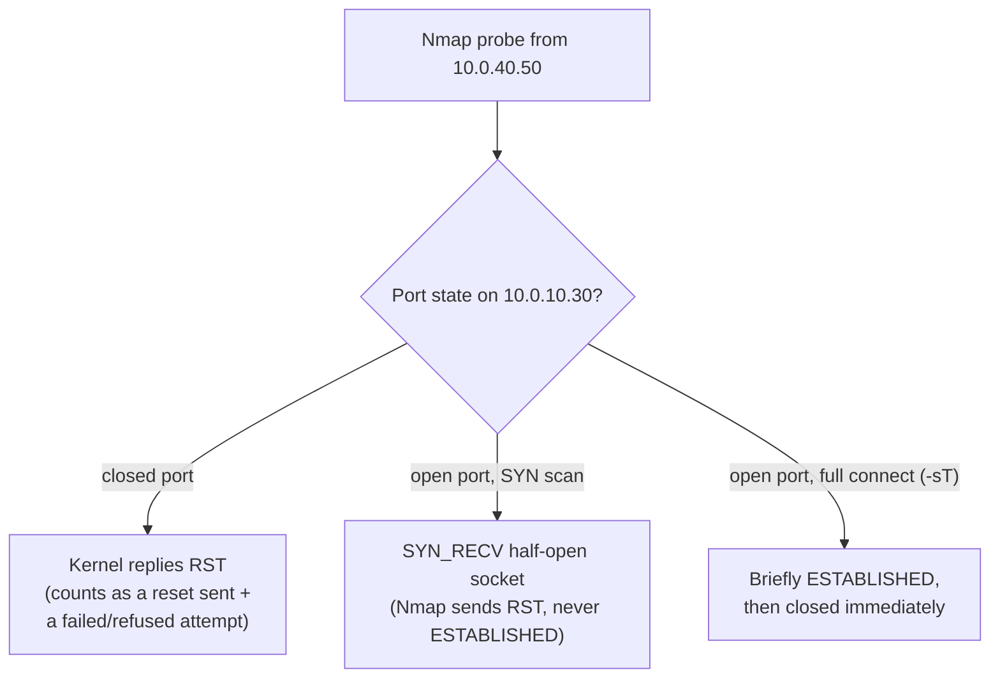
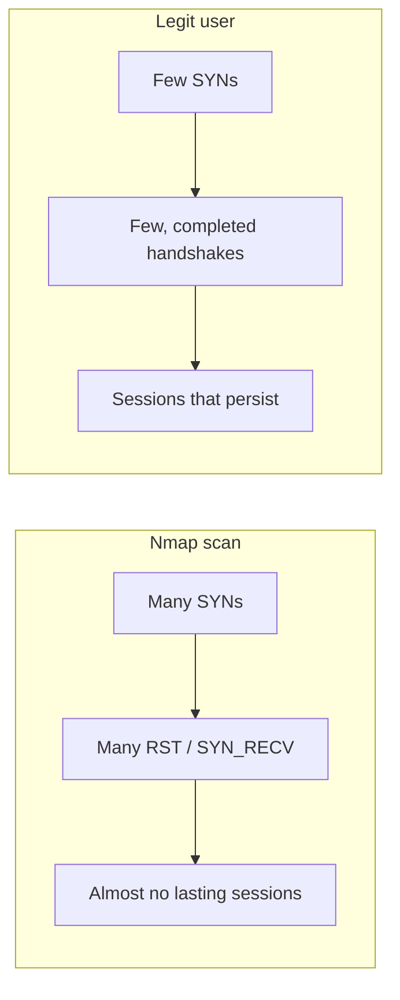
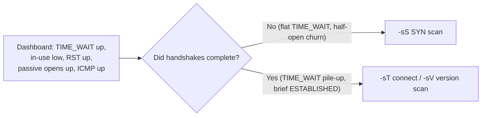
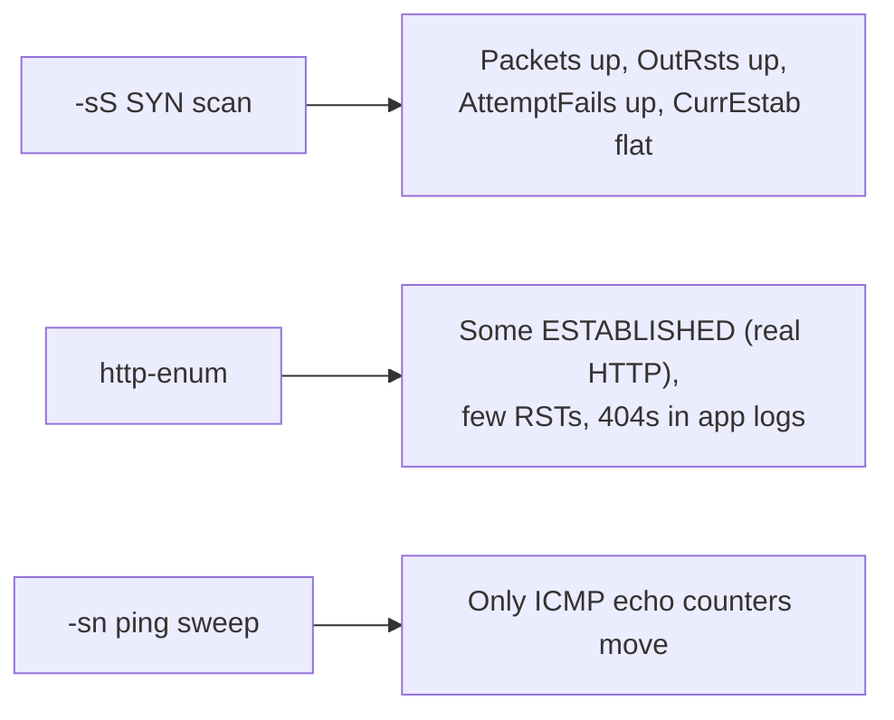
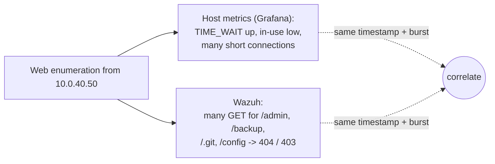

# Incident Response Series - Module 1 Exercise 2: Spotting Nmap Scans in Host Network Metrics (Grafana)

Exercise 1 looked at **alerts** (Suricata/WAF/firewall) in Wazuh. This exercise is
different: here you only have the **Grafana dashboard fed by node_exporter** on the Linux
box hosting DVWA (`10.0.10.30`). No IDS signatures, no WAF verdicts - just raw host
network telemetry. The question is: *can you tell a scan happened from metrics alone, and
what exactly do you look at?*

Short version of the answer:
- You will **not** see a pile of established TCP sockets. Most scans never finish the
  handshake, so sockets never reach `ESTABLISHED`.
- What you **will** see is **rate and counter movement**: a spike in inbound packets, a
  burst of **half-open (`SYN_RECV`) sockets**, a jump in **TCP resets sent**, and a jump
  in **failed/refused connection attempts**. The *shape* (sharp spike, then back to
  baseline) is as important as the numbers.

> Metric names below are **Prometheus node_exporter** metrics (the exporter installed by
> `SLCA 1 click installs/prometheus_install_node_exporter.sh`). PromQL is written to paste
> into Grafana panels. Exact availability depends on your kernel and node_exporter version.

---

## The whole exercise as one restaurant story

Picture the DVWA server as a **restaurant**. Each **port** is a **table** the restaurant
can seat you at (one serves pizza, one serves drinks, one serves dessert, and so on). The
Grafana dashboard is the restaurant's **CCTV and till logs**. You are the manager watching
the screens. You can't see the troublemaker's face (node_exporter has no source IP), but
you can watch what they *do* in the dining room, and that is enough to know something is
wrong.

Here is what a scan looks like, step by step. Every metric section below is just one
camera pointed at one step of this same story:

- **Step 0 - Phoning ahead.** Before showing up, the person rings every restaurant asking
  "are you open tonight?" just to see which ones answer. *(ICMP ping sweep - section 5.)*
- **Step 1 - A rush through the door.** They hurry in and start going table to table very
  fast. The "people arriving" counter suddenly jumps. *(Packet/connection rate - section 1.)*
- **Step 2 - Trying every table that is not available.** They walk up to every table,
  including the ones that aren't in service. Each one gets a flat "sorry, that's not
  available", hundreds of these refusals in seconds. *(TCP resets - section 2.)*
- **Step 3 - Grabbing a table but never ordering.** At some tables they sit down and then
  get up and leave without ordering anything, so lots of tables look taken but nobody is
  actually eating. *(Half-open sockets - section 3.)*
- **Step 4 - Seated and gone, over and over.** At the tables that are open they sit, order
  one thing, and leave within seconds, again and again, so the "tables to clear" pile grows
  while no table is actually in use. *(TIME_WAIT vs in-use - section 3a.)*
- **The tell.** Loads of people arriving, loads of refusals, but almost nobody actually
  sitting down to eat. *(Eating-vs-arrivals ratio - section 4.)* A genuinely busy night
  keeps the tables full; a scan does not.
- **Step 5 - Reading out dishes that aren't on the menu.** Once inside (the front door,
  port 80, is open) they read down a list, "do you serve admin? backups? phpmyadmin?", and
  every one comes back "that's not on the menu". *(Wazuh 404 flood - later section.)*

Keep this story in your head. When a panel moves, ask: *which step of the scan is this
camera showing me?*

| Step of the scan | What it is on the server | Grafana metric |
| --- | --- | --- |
| 0. Phoning every restaurant: "are you open?" | Ping sweep | ICMP echoes |
| 1. A rush of people through the door | Burst of connection attempts (SYN) | passive/active opens, packets/sec |
| 2. Trying every unavailable table | Closed ports reply "no" (RST) | TCP resets sent |
| 3. Grabbing a table but never ordering | Half-finished handshakes | half-open / failed attempts |
| 4. Seated and straight back out, over and over | Connect then instantly close | TIME_WAIT pile-up, in-use low |
| The tell: almost nobody actually eats | Few lasting connections vs many attempts | ESTABLISHED vs attempts |
| 5. Asking for dishes that aren't on the menu | Requesting many paths that don't exist | Wazuh 404 flood |

---

## Why a scan looks the way it does (the key idea)

An Nmap scan is **many connection attempts, few completed connections**. That mismatch is
the whole fingerprint. (In the restaurant story: lots of people walking up to tables,
almost nobody actually eating.) Walk through what the kernel on `10.0.10.30` does for each
probe:



So the telltales are: **lots of RSTs, lots of half-open sockets, lots of failed attempts,
very few lasting ESTABLISHED connections.** A real user is the opposite: few connections,
each lasting a while, almost no RSTs.



---

## What to watch, by metric

### 1. Inbound packet / connection rate (the first flag)

A scan drives a short, sharp spike in received packets and new connections, then drops
back to baseline. That spike shape is the easiest thing to eyeball on a time series.

- **Received packets/sec** (per interface):
  ```promql
  rate(node_network_receive_packets_total{instance="10.0.10.30:9100"}[1m])
  ```
- **New TCP connections accepted/sec** (passive opens = inbound handshakes):
  ```promql
  rate(node_netstat_Tcp_PassiveOpens{instance="10.0.10.30:9100"}[1m])
  ```
- **New connection attempts/sec** (active + passive):
  ```promql
  rate(node_netstat_Tcp_ActiveOpens{instance="10.0.10.30:9100"}[1m])
  ```

What to look for: a baseline near-flat line that **jumps sharply** for the duration of the
scan, then returns to baseline. A `-T4` aggressive scan makes this obvious; a slow
`-T1`/`-T2` scan flattens the spike (see "evasion" below).

> **Restaurant story - Step 1: the rush through the door.** This camera is the "people
> arriving" counter. All night it ticks up slowly as the odd diner walks in. Then the
> scanner hurries in and starts going table to table fast, and the counter shoots straight
> up for a few seconds before falling quiet again. That sudden spike-then-silence is the
> sign of someone who came to *work the whole room*, not to eat a meal. Real rushes build
> and ease off gently; a scan arrives all at once.
>
> **Example:** idle baseline ~5 packets/sec. You run `nmap -sS`; the panel jumps to ~2,000
> packets/sec for 3 seconds, then falls back to ~5. Nobody browsing a website does that.

### 2. TCP resets sent (the strongest single tell)

Closed ports answer with RST. A port scan hits many closed ports, so **resets sent**
spikes hard. This is often the clearest scan signal in host metrics.

```promql
rate(node_netstat_Tcp_OutRsts{instance="10.0.10.30:9100"}[1m])
```

A browser almost never triggers RSTs. A sudden burst of `OutRsts` from a quiet baseline is
"someone is walking up to lots of tables that aren't available."

> **Restaurant story - Step 2: trying every unavailable table.** A RST is the waiter
> telling someone **"sorry, that table's not available"** and turning them away. A normal
> diner only goes to the one table they're seated at, so they get ~zero refusals. The
> scanner walks up to all 1,000 tables, 990 of them not in service, so the waiters say
> "not available" 990 times in a couple of seconds.
>
> **Example:** idle baseline = 0 RSTs/sec. During the scan the panel spikes to hundreds
> per second. If you only had one camera to catch a scan, point it here - "why are the
> waiters turning hundreds of people away every second?"

### 3. Half-open sockets (SYN_RECV) - the "no, I will NOT see ESTABLISHED" answer

This is the metric that answers your question directly. A SYN scan leaves connections in
`SYN_RECV` (half-open) because the handshake is never completed. You see the **half-open
count rise**, not the established count.

- **Sockets currently in TIME_WAIT / orphaned / allocated** (overview of churn):
  ```promql
  node_sockstat_TCP_inuse{instance="10.0.10.30:9100"}
  node_sockstat_TCP_tw{instance="10.0.10.30:9100"}      # TIME_WAIT, rises with churn
  node_sockstat_TCP_orphan{instance="10.0.10.30:9100"}
  ```
- **Failed connection attempts/sec** (handshakes that never completed):
  ```promql
  rate(node_netstat_Tcp_AttemptFails{instance="10.0.10.30:9100"}[1m])
  ```
- **Passive connection failures (SYN_RECV that never finished):**
  ```promql
  rate(node_netstat_TcpExt_ListenDrops{instance="10.0.10.30:9100"}[1m])
  rate(node_netstat_TcpExt_ListenOverflows{instance="10.0.10.30:9100"}[1m])
  ```

> **Restaurant story - Step 3: grabbing a table but never ordering.** A half-open
> connection is like someone who **sits down at a table and then gets up and leaves**
> before ordering. Getting seated properly takes three steps (ask for a table -> "yes, sit
> here" -> actually sit and order); a SYN scan does the first two and skips the third. The
> result is lots of tables that look taken but no one actually eating. The tell is that
> mismatch: *lots of tables grabbed, nobody ordering.*
>
> **Example:** `AttemptFails` climbs during the scan while `CurrEstab` (people actually
> eating) barely moves. Tables grabbed goes up, people eating doesn't - that gap IS the
> scan.

> node_exporter does not expose a direct "SYN_RECV count" gauge. You infer half-open
> activity from `AttemptFails`, `ListenDrops`, the gap between `PassiveOpens` and lasting
> `ESTABLISHED`, and a rise in `TCP_tw`/churn. If you want a true per-state socket count,
> add a small `ss -s` / `ss -tan state syn-recv | wc -l` collector (see "going deeper").

### 3a. Reading the "TIME_WAIT up, in-use low" signature (connect-style scans)

A very common real observation on this dashboard is: **`node_sockstat_TCP_tw` (TIME_WAIT)
climbs sharply while `node_sockstat_TCP_inuse` (established/in-use) stays low**, alongside
rising passive opens, RSTs, and packet/ICMP rates. That exact combination is diagnostic,
and it points at a **full-connect scan (`nmap -sT`) or version scan (`-sV`)**, not a pure
SYN scan.

Why that shape appears:

```
-sS (SYN scan):      SYN -> SYN/ACK -> RST          never ESTABLISHED, so NO TIME_WAIT
-sT (connect scan):  SYN -> SYN/ACK -> ACK -> FIN   ESTABLISHED for ms, then -> TIME_WAIT
```

- A **SYN scan** never completes the handshake, so connections never pass through
  `ESTABLISHED` and never enter `TIME_WAIT`. You'd see half-open churn and RSTs but a
  **flat TIME_WAIT**.
- A **connect/version scan** *completes* each handshake and then closes it immediately.
  The side that closes first holds the socket in **`TIME_WAIT`** for ~60s (2x MSL) to
  absorb stray packets. Hundreds of millisecond-long connections therefore produce **a
  pile of TIME_WAIT sockets** while almost nothing is concurrently `ESTABLISHED`.

So: **TIME_WAIT high + in-use low = many short-lived, fully-completed connections = a
connect-style scan sweeping ports/services.**

> **Restaurant story - Step 4: seated and straight back out.** TIME_WAIT is the pile of
> **tables waiting to be cleared** after each diner leaves - the busser needs ~a minute to
> reset a table before it can be used again. This scanner actually gets seated at the open
> tables, but instead of staying they **sit, order one thing, and leave** at every table.
> So the "tables to clear" pile grows huge (`TIME_WAIT` high) while the number of tables
> *currently in use* stays near zero (`in-use` low). A genuinely busy night is the
> opposite: the tables stay full and only clear slowly.
>
> **Example:** `TIME_WAIT` jumps from ~10 to ~800 in seconds while `in-use` stays around
> 2-3. That "huge pile of tables to clear, empty dining room" combo is the signature of a
> `-sT`/`-sV` scan specifically - the scanner finished each handshake (so the table needs
> clearing) but never stayed.



How to confirm it's a scan and not a legit short-connection workload:
- **Real users / health checks** that open short connections do raise TIME_WAIT too, but
  they come from a **small set of known sources** and at a **steady** rate. A scan is a
  **sharp burst** from **one source** across **many ports**, then silence.
- Cross-check the burst **timestamp** against the firewall/Suricata logs (Exercise 1):
  one `src=10.0.40.50` touching many `dst` ports in the same window confirms the scan and
  gives you the attacker IP that node_exporter can't show.
- The **ICMP in/out spike** you saw usually corresponds to Nmap's host-discovery ping
  before (or during) the port sweep - another corroborating marker that this is active
  reconnaissance, not organic traffic.

Panels to pair for this signature:
```promql
# TIME_WAIT climbing...
node_sockstat_TCP_tw{instance="10.0.10.30:9100"}
# ...while in-use stays low (overlay the two on one panel)
node_sockstat_TCP_inuse{instance="10.0.10.30:9100"}
# with the churn driver visible alongside
rate(node_netstat_Tcp_PassiveOpens{instance="10.0.10.30:9100"}[1m])
rate(node_netstat_Tcp_OutRsts{instance="10.0.10.30:9100"}[1m])
```

### 4. Established vs attempts - the ratio that gives it away

Compute the ratio of lasting connections to attempts. During a scan it collapses toward
zero (many attempts, few establish). This single panel separates a scan from a traffic
surge of real users.

```promql
# current established sockets
node_netstat_Tcp_CurrEstab{instance="10.0.10.30:9100"}

# attempts per second (should dwarf established during a scan)
rate(node_netstat_Tcp_ActiveOpens{instance="10.0.10.30:9100"}[1m])
+ rate(node_netstat_Tcp_PassiveOpens{instance="10.0.10.30:9100"}[1m])
```

Interpretation: if attempts/sec is high but `CurrEstab` stays low, that's a scan. If both
rise together and stay up, that's real traffic.

> **Restaurant story - the tell that ties it together.** Put two numbers side by side:
> **"people walking up to a table" vs "people actually eating."** On a real busy night both
> climb together - more arrivals means more tables in use. During a scan, arrivals explode
> but the tables stay empty, because the scanner never settles down to eat. So the one
> question that separates "we got busy" from "we got scanned" is: *did all those arrivals
> turn into anyone actually eating?* Scan = no. Real rush = yes.
>
> **Example:** Friday-night rush: attempts up to 500/sec AND `CurrEstab` up to 400 and
> *holding* -> real diners. Scan: attempts up to 500/sec but `CurrEstab` stuck at 3 ->
> nobody's eating, it's a scan.

### 5. ICMP (catches the `-sn` ping sweep)

A ping sweep never touches TCP, so sections 1-4 stay quiet. ICMP counters catch it:

```promql
rate(node_netstat_Icmp_InEchos{instance="10.0.10.30:9100"}[1m])    # echo requests in
rate(node_netstat_Icmp_OutEchoReps{instance="10.0.10.30:9100"}[1m]) # echo replies out
```

A spike in `InEchos` with matching `OutEchoReps` from one short window = ping sweep.

> **Restaurant story - Step 0: phoning ahead.** This is the scanner *before* they come in
> at all - **ringing every restaurant to ask "are you open tonight?"** and noting which
> ones pick up, so they know which are worth visiting. No tables tried yet, so every TCP
> camera (sections 1-4) stays flat; only this ICMP camera moves. If ICMP spikes and nothing
> else does, someone is sizing up which restaurants exist - and the rush-through-the-door
> step usually follows within seconds.
>
> **Example:** `InEchos` jumps for one second, matched by `OutEchoReps`, and every other
> panel is flat. That lonely ICMP blip is the `-sn` host-discovery sweep - usually the
> very first move, before the port scan that follows.

---

## Mapping each Nmap scan to what moves on the dashboard

| Nmap scan | Packets/sec | OutRsts | AttemptFails / half-open | CurrEstab | ICMP |
| --- | --- | --- | --- | --- | --- |
| `-sn` ping sweep | small blip | - | - | - | **spike** |
| `-sS` SYN scan | **spike** | **spike** (closed ports) | **spike** | stays low | - |
| `-sT` full connect | **spike** | spike | spike | brief tiny bumps | - |
| `-sV -sC` | spike | spike | spike | small (real HTTP connects) | - |
| `http-enum` (-p80) | moderate | low | low | several short HTTP conns | - |
| `--script vuln` (-p80) | moderate-high | low-moderate | low | **many short HTTP conns** (payloads) | - |
| `-A -T4` | **big spike** | **big spike** | **big spike** | low vs attempts | maybe |

The pattern: **network-layer scans (`-sn`, `-sS`) move packet/RST/half-open metrics but
barely touch `CurrEstab`.** Application scans (`http-enum`) actually complete some
connections, so you see more real `ESTABLISHED` and app activity but fewer RSTs.



---

## Suggested Grafana panels for this exercise

Build a row called **"Scan indicators"** with these panels, all scoped to
`instance="10.0.10.30:9100"`:

1. **Received packets/sec** - `rate(node_network_receive_packets_total[1m])`
2. **TCP resets sent/sec** - `rate(node_netstat_Tcp_OutRsts[1m])`
3. **Connection attempts/sec vs established** - overlay
   `rate(node_netstat_Tcp_ActiveOpens[1m]) + rate(node_netstat_Tcp_PassiveOpens[1m])`
   against `node_netstat_Tcp_CurrEstab`
4. **Failed attempts/sec** - `rate(node_netstat_Tcp_AttemptFails[1m])`
5. **TIME_WAIT / socket churn** - `node_sockstat_TCP_tw` and `node_sockstat_TCP_inuse`
6. **ICMP echoes/sec** - `rate(node_netstat_Icmp_InEchos[1m])`

Set the time range to a few minutes around when you run each scan from `10.0.40.50`.

---

## Run it

1. On the dashboard, note the baseline for each panel while the box is idle.
2. From `10.0.40.50`, run the scans one at a time, pausing between them so each spike is
   distinct on the time series:
   ```bash
   nmap -sn 10.0.10.30
   nmap -sS 10.0.10.30
   nmap -sT 10.0.10.30
   nmap -p80 --script http-enum 10.0.10.30
   nmap -sV --script vuln -p80 10.0.10.30
   nmap -A -T4 10.0.10.30
   ```
3. For each scan, watch which panels move and by how much. Match them to the table above.

### Check questions

- During the `-sS` scan, did `node_netstat_Tcp_CurrEstab` rise much? Why not? (This is the
  "I won't see lots of ESTABLISHED sockets" lesson.)
- Which single metric moved the most for `-sS`? (Hint: closed ports and RSTs.)
- The `-sn` ping sweep: which panels stayed flat, and which one caught it?
- Compare `-sS` vs `http-enum`: which produced more real `ESTABLISHED` connections, and
  why does that make sense given one is L4 and the other L7?
- If an attacker used `-T1` (very slow) instead of `-T4`, how would the spikes change, and
  what does that tell you about relying on rate panels alone?

---

## Meanwhile, on the Wazuh side: failed file/directory lookups

While the host dashboard shows the *shape* of the traffic (short connections, TIME_WAIT
churn, RSTs), Wazuh shows the *content* of those same requests. A very common companion
observation is **lots of "failed attempts" for files and directories** - a flood of
requests for paths that don't exist, each returning `404` (not found) or `403`
(forbidden).

This is the **web content enumeration** phase of the scan (Nmap `--script http-enum`, or a
follow-on tool like `gobuster` / `dirb` / `feroxbuster` / `nikto`). Each of those probes
is one of the short-lived connections you saw pile up as TIME_WAIT on the host. The two
dashboards are describing **the same event from two angles**:



What this looks like in Wazuh (representative):
```
rule.description="Web access: GET /admin/ 404"      data.src_ip=10.0.40.50 data.status=404
rule.description="Web access: GET /phpmyadmin/ 404" data.src_ip=10.0.40.50 data.status=404
rule.description="Web access: GET /backup/ 404"     data.src_ip=10.0.40.50 data.status=404
rule.description="Web access: GET /.git/config 404" data.src_ip=10.0.40.50 data.status=404
rule.description="Web access: GET /DVWA/config/ 403" data.src_ip=10.0.40.50 data.status=403
# Wazuh will often roll these up into a frequency/burst rule, e.g.
rule.description="Multiple web 404s from same source (possible enumeration/scan)"
data.srcip=10.0.40.50 rule.level=7 rule.frequency=... groups=[web,recon,attack]
```

The enumeration fingerprint in Wazuh:
- **One source IP** requesting **many distinct URIs** in a short window.
- A **high `404` ratio** with occasional `403`, almost no `200`.
- Paths are **well-known names** (`/admin`, `/wp-admin`, `/.env`, `/.git/config`,
  `/phpmyadmin`, `/backup`) - not links a real user would click in sequence.
- A **tool user-agent** when present (`Nmap Scripting Engine`, `gobuster`, `nikto`).

> **Restaurant story - Step 5: asking for dishes that aren't on the menu.** The scanner is
> now inside (the front door, port 80, was open) and is **reading down a list of dishes** -
> "do you serve `/admin`? `/backup`? `/phpmyadmin`?" - asking for each one. Every one comes
> back **"that's not on the menu" (404)**. Hundreds of not-on-the-menu answers for one
> person reading down a list looks nothing like a real diner, who orders the two or three
> things they came for. That wall of 404s from a single source is the sound of the scanner
> reading the whole menu, hunting for something worth attacking.

> **Important distinction: "failed attempts" here = failed *resource lookups* (`404`/
> `403`), not failed *logins*.** Directory/file enumeration is *reconnaissance* - mapping
> what exists on the server. That is different from a **brute-force / credential attack**,
> which shows up as repeated `POST /DVWA/login.php` returning `302` back to
> `/DVWA/login.php` (a failed login redirects to itself) from one source. If you see that
> login pattern instead of (or in addition to) the `404` flood, treat it as brute force,
> not enumeration. Both can come from the same attacker, in sequence: enumerate first,
> then attack what was found.

**Cross-dashboard confirmation (the whole point):** a burst on the host's TIME_WAIT/RST
panels *at the same timestamp* as a burst of `404`s from `10.0.40.50` in Wazuh is a
high-confidence "web scan in progress" - the host view proves the traffic shape, the Wazuh
view proves the intent and gives you the attacker IP.

---

## Limitations and evasion (teach this too)

- **Host metrics are blunt.** They tell you *something abnormal happened* (lots of
  attempts, lots of RSTs) but not *which ports* or *the attacker's intent*. For that you
  still need Suricata/firewall/WAF logs from Exercise 1. Host metrics are a **corroborating
  signal**, not a standalone detector.
- **Slow scans hide in the noise.** `-T1`/`-T2` or `--scan-delay` spread probes over
  minutes so no sharp spike forms. Rate panels may miss them; a cumulative counter view
  (total RSTs/attempts over an hour) catches them better than a 1-minute rate.
- **You can't see source IP in node_exporter.** These metrics are host-wide aggregates.
  To attribute the spike to `10.0.40.50`, correlate the **timestamp** of the spike with
  the firewall/Suricata logs that do carry the source IP.
- **No ESTABLISHED pile-up is normal for scans** - don't wait for it. The absence of
  lasting connections *alongside* a flood of attempts is itself the signature.

---

## Going deeper (optional): a true per-state socket count

If you want an actual `SYN_RECV` / `ESTABLISHED` count on the panel, add a textfile
collector that runs `ss` on a timer and writes a metric node_exporter can scrape:

```bash
# /usr/local/bin/socket_states.sh  (run via cron/systemd timer into the textfile dir)
echo "node_tcp_syn_recv $(ss -tan state syn-recv | tail -n +2 | wc -l)"
echo "node_tcp_established $(ss -tan state established | tail -n +2 | wc -l)"
```

Then graph `node_tcp_syn_recv` directly - during a `-sS` scan you'll watch it climb while
`node_tcp_established` stays flat, which is the cleanest possible demonstration of the
point of this exercise.

### What's next

- **Exercise 3 (optional) -** correlate a metric spike here with the exact Suricata/
  firewall log lines (and source IP `10.0.40.50`) from Exercise 1, so students practice
  pivoting from "a graph looks weird" to "here's who did it."
